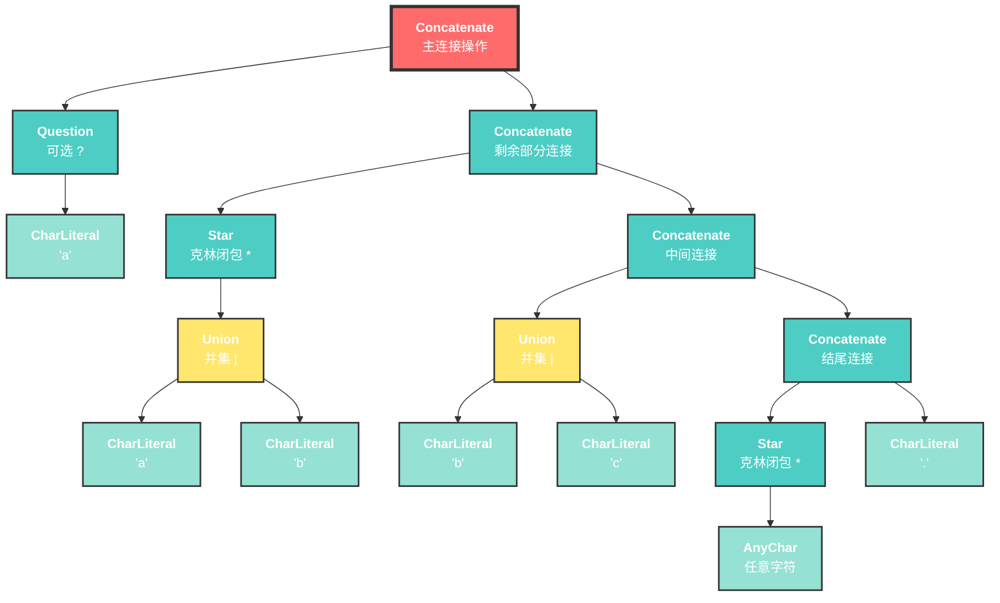
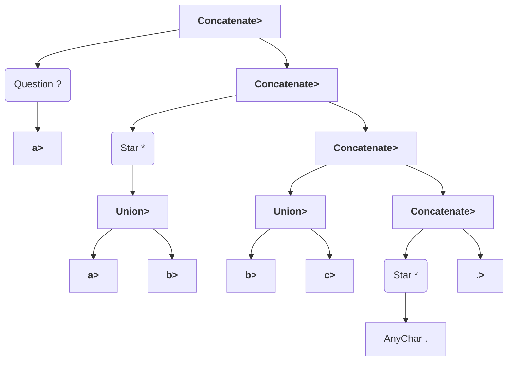

# a regex engine writen by haskell

- regular expression -> regex tokens -> regex ast -> regex nfa -> regex dfa

- ast-tree-test

> a?(a|b)\*(b|c).\*/.

```mermaid
graph TD
    Root["<b>Concatenate</b><br/>主连接操作"]
    
    Q["<b>Question</b><br/>可选 ?"]
    RestConcat["<b>Concatenate</b><br/>剩余部分连接"]
    
    QChar["<b>CharLiteral</b><br/>'a'"]
    
    Star1["<b>Star</b><br/>克林闭包 *"]
    MidConcat["<b>Concatenate</b><br/>中间连接"]
    
    Union1["<b>Union</b><br/>并集 |"]
    Union2["<b>Union</b><br/>并集 |"]
    EndConcat["<b>Concatenate</b><br/>结尾连接"]
    
    A1["<b>CharLiteral</b><br/>'a'"]
    B1["<b>CharLiteral</b><br/>'b'"]
    B2["<b>CharLiteral</b><br/>'b'"]
    C["<b>CharLiteral</b><br/>'c'"]
    
    Star2["<b>Star</b><br/>克林闭包 *"]
    Dot["<b>CharLiteral</b><br/>'.'"]
    
    Any["<b>AnyChar</b><br/>任意字符"]
    
    Root --> Q
    Root --> RestConcat
    
    Q --> QChar
    
    RestConcat --> Star1
    RestConcat --> MidConcat
    
    Star1 --> Union1
    Union1 --> A1
    Union1 --> B1
    
    MidConcat --> Union2
    MidConcat --> EndConcat
    
    Union2 --> B2
    Union2 --> C
    
    EndConcat --> Star2
    EndConcat --> Dot
    
    Star2 --> Any
    
    classDef root fill:#ff6b6b,stroke:#333,stroke-width:4px,color:#fff
    classDef quantifier fill:#4ecdc4,stroke:#333,stroke-width:2px
    classDef union fill:#ffe66d,stroke:#333,stroke-width:2px
    classDef leaf fill:#95e1d3,stroke:#333,stroke-width:2px
    
    class Root root
    class Q,RestConcat,Star1,MidConcat,EndConcat,Star2 quantifier
    class Union1,Union2 union
    class QChar,A1,B1,B2,C,Dot,Any leaf
```

```mermaid
graph TD
    Node0["<b>Concatenate><br/>"]
    Node1("Question ?")
    Node1 --> Node2
    Node2["<b>a><br/>"]


    Node0-->Node1
    Node0-->Node3
    Node3["<b>Concatenate><br/>"]
    Node4("Star *")
    Node4 --> Node5
    Node5["<b>Union><br/>"]
    Node6["<b>a><br/>"]

    Node5-->Node6
    Node5-->Node7
    Node7["<b>b><br/>"]


    Node3-->Node4
    Node3-->Node8
    Node8["<b>Concatenate><br/>"]
    Node9["<b>Union><br/>"]
    Node10["<b>b><br/>"]

    Node9-->Node10
    Node9-->Node11
    Node11["<b>c><br/>"]


    Node8-->Node9
    Node8-->Node12
    Node12["<b>Concatenate><br/>"]
    Node13("Star *")
    Node13 --> Node14
    Node14["AnyChar ."]


    Node12-->Node13
    Node12-->Node15
    Node15["<b>.><br/>"]


```
